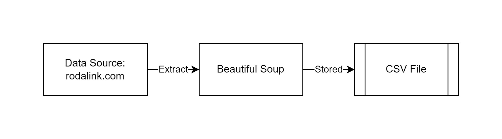
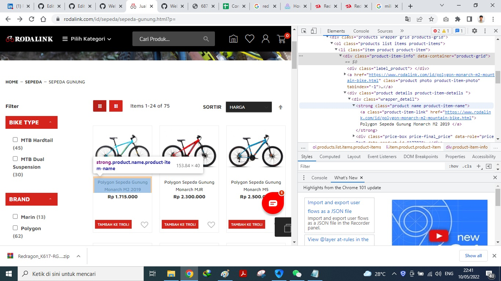

# Web-Scrapping
Web Scrapping using Beautiful Soup  
Name: Bernard Evan Kanigara

## Project Description
This project demonstrate a web scrapping using Beautiful Soup. It scrap the mountain bike name and price from https://www.rodalink.com/. The data is stored in the CSV file.

## Project Step
Step of this project are:
1. Import library
2. Extract data from the web
3. Transform the data
4. Store data

### Import Library
The library and modules for this project are:
- Requests
- Beautiful Soup 
- Pandas
- Sub
- Decimal

The request and beautiful soup are used to do the web scrapping of the sites. While Pandas are used for the managing the dataframe of the stored data and also stored the data in the csv format. And the last sub and decimal are used to transform the data into the desired output.

### Extract Data
We use Beautiful Soup to extract the data from the sites. The webiste are `https://www.rodalink.com/id/`. While the data that we want to extract are reside on the `https://www.rodalink.com/id/sepeda/sepeda-gunung.html?p=`. To test that the sites are responsive, we need to check it with: 

    req=requests.get(url,headers=headers)
    print(req)
    
If the `req` returned as *200* then the API is working and we can continue to the next step. In this next step, we must specify what kind of data that we want to extract with Beautiful Soup. We can get the details by click in the desired data using inspect element. In this case, we only want to know the bicycle name and it's price. 

After we get the targeted path, we can put it in the code. The code will be:

    soup=BeautifulSoup(req.text,"html.parser")
    items=soup.findAll('div','product details product-item-details')
    for it in items:
        name=''.join(it.find('strong','product name product-item-name').text.strip().split('\n'))
        print(name)
        price=''.join(it.find('span','price-container price-final_price tax weee').text.strip().split('\n'))
        print(price)
        
After the *price* and *name* can be extracted. The data will be stored in the dataframe. 

### Transform the Data
For the transformation we only need to transform the *price* feature from `Rp 102.000.000` to readable integer type. So we need regex to tranform it. The code willl be: 

    df['Price'] = df['Price'].str.replace(r'\D', '').astype(int)
    
    
### Stored the Data
The data thus stored in the csv format. We use the dataframe to csv mdoules from Pandas. The code will be: 

    df.to_csv('harga_sepeda.csv')

## Contact
- LinkedIn: [Bernard Evan Kanigara](https://www.linkedin.com/in/bernard-evan-kanigara/)
- Email: bernardevankanigara@gmail.com

Thank you!
